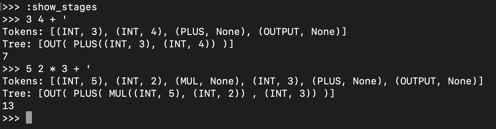

# Slang (Stack-Lang)

made to learn the stages of language translation. Just for fun 👍

Stages:
---------
- Lexical Analysis (creating tokens from expression)
- Generate Syntax tree, from given tokens, based on language rules and instruction significance
- Syntax tree is recursively traversed and each branch is evaluated

Screenshot:
---------

